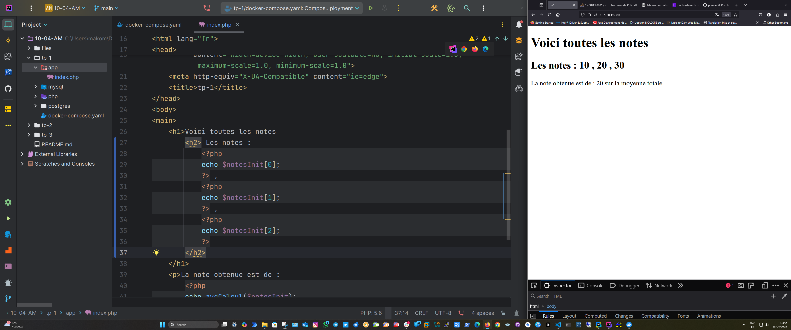

# 📘 PHP Mini Projects

This repository contains three simple PHP projects (TP1 to TP3) as exercises for learning basic programming concepts such as arrays, functions, and conditional logic.

---

## 📌 Table of Contents

- [TP1: Grade Average Calculator](#tp1-grade-average-calculator)
- [TP2: Random Quote Generator](#tp2-random-quote-generator)
- [TP3: Simple Library Management System](#tp3-simple-library-management-system)
- [🖼️ Screenshots](#️-screenshots)
- [💻 Technologies](#-technologies)
- [📂 Structure](#-structure)
- [📎 License](#-license)

---

## TP1: Grade Average Calculator

### 🎯 Objective
Create a simple calculator that computes the average of several grades.

### 🛠️ Features
- Create an array of grades
- Create a function to calculate the average
- Display the average of the grades
- Add a new grade and recalculate the average

---

## TP2: Random Quote Generator

### 🎯 Objective
Create a random quote generator using an array of quotes.

### 🛠️ Features
- Create an array of quotes
- Create a function that returns a random quote
- Display the quote on the page

---

## TP3: Simple Library Management System

### 🎯 Objective
Build a basic library system where users can add, search, and display books.

### 🛠️ Features
- Store book data using an array (title, author, year)
- Display all books
- Add a new book using the `addBook` function
- Search for a book by title using the `searchBook` function

> 🔸 Note: Page display does not automatically update after adding or searching — results are shown in the console or terminal.

---

## 🖼️ Screenshots

### TP1 – Calculator  

### TP2 – Average citations  

### TP3 – Library Management  

---

## 💻 Technologies

- PHP 8.x
- HTML5
- (Optional) CSS for styling

---

## 📂 Structure

## 📎 License

This project is for educational purposes only.
